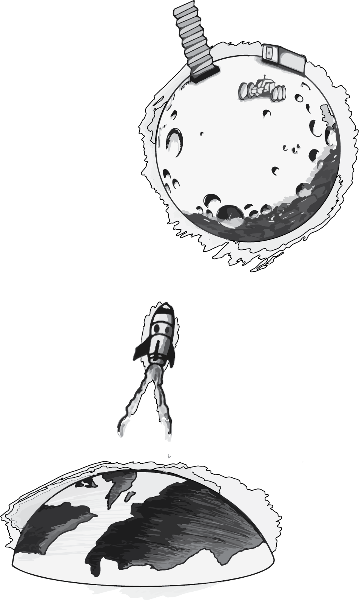
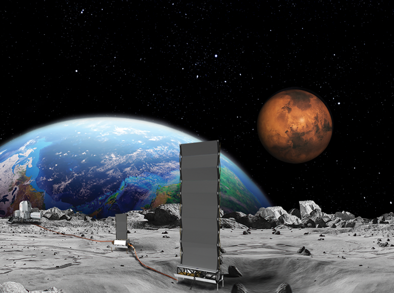
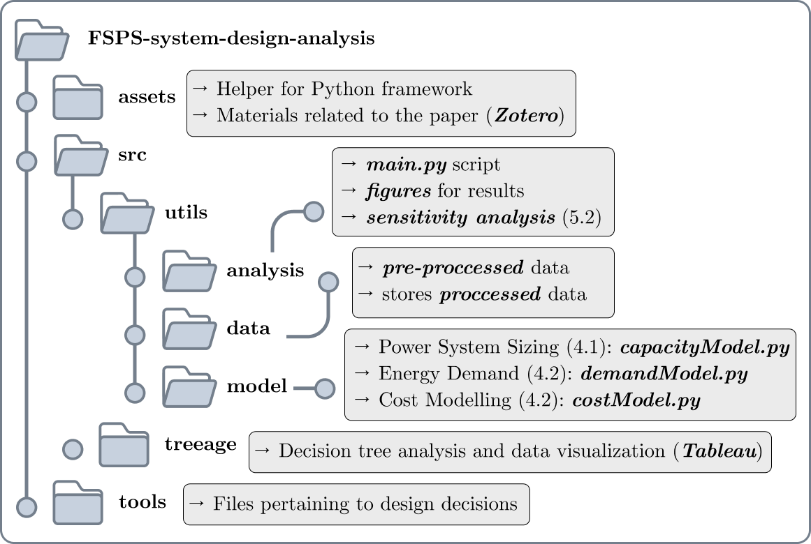
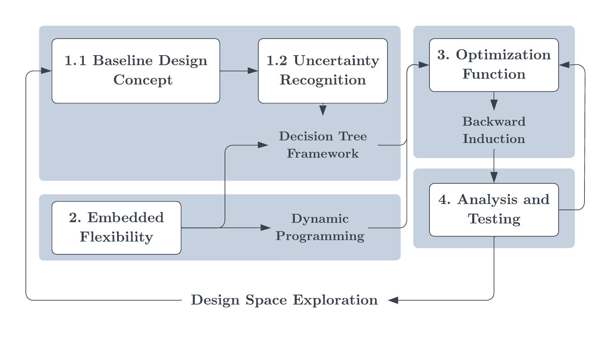

# FSPS System Design and Analysis 🚀

  This repository contains the code and data for the Master's thesis project titled "Powering the Moon: Engineering System Design and Analysis for Flexible Nuclear Fission Surface Power under Demand Uncertainty" by Kennard S. Mah, Imperial College London.



## Table of Contents 📋
- [Introduction 🌍](#introduction-)
- [Repository Structure 🗂️](#repository-structure-)
- [Installation 💻](#installation-)
- [Usage ⚙️](#usage-)
- [Methodology 📈](#methodology-)
- [Case Application 🛰️](#case-application-)
- [Results and Discussion 📊](#results-and-discussion-)
- [Acknowledgements 🙏](#acknowledgements-)

## Introduction 🌍

  The project aims to develop a sustainable energy solution for a lunar outpost using a Nuclear Fission-based Surface Power System (FSPS). The proposed model incorporates embedded flexibility to adapt to changing conditions and demand uncertainties, minimizing the Levelized Cost of Electricity (LCOE).



## Repository Structure 🗂️
The repository is structured as follows:



## Installation 💻
To install and run the project, follow these steps:

1. Clone the repository:
    ```bash
    git clone https://github.com/kennardmah/fsps-system-design-analysis.git
    cd fsps-system-design-analysis
    ```

2. Create a virtual environment and activate it:
    ```bash
    python -m venv venv
    source venv/bin/activate  # On Windows use `venv\Scripts\activate`
    ```

3. Install the required dependencies:
    ```bash
    pip install -r requirements.txt
    ```

## Usage ⚙️
To run the analysis and generate results, use the following commands:

1. Run the main analysis script:
    ```bash
    python ###To Be Updated###
    ```

## Methodology 📈
The methodology follows a structured, four-phase framework to design a flexible lunar energy system under demand uncertainty:

1. **Baseline Design Concept and Uncertainty Recognition**
2. **Embedded Flexibility**
3. **Optimisation Function**
4. **Analysis and Testing**



## Case Application 🛰️
The case application integrates power system sizing, cost modeling, and energy demand requirements to evaluate different strategies. The scenarios analyzed include both flexible and inflexible deployment strategies.

## Results and Discussion 📊
The results show that embedding flexibility in the FSPS design can reduce the LCOE by approximately 5.49% and significantly decrease the variance in LCOE compared to inflexible strategies. Detailed results and sensitivity analyses are provided in the `Results and Discussion` section of the thesis. The research demonstrates that incorporating flexibility into the design of FSPS can offer significant financial and operational benefits, making it a viable solution for managing the uncertainties of lunar energy demands.

## Acknowledgements 🙏
I would like to extend my heartfelt gratitude to everyone who made this project possible. Special thanks to Prof. Michel-Alexandre Cardin for his guidance and for granting me the autonomy to shape my work. Thank you to Kosuke Ikeya for the continuous support and assistance in making my work legible. I am grateful to my colleagues for the countless days spent together in the lounge, enjoying the “PhD students only” coffee. Lastly, I extend my appreciation to the space enthusiasts who provided their invaluable input through interviews and coffee chats.
